# Step by Step: Social programming 

Social programming Practice based on 

The Prototype Project : Real-time Monitoring System for Thermal Power Plant 

bootProcessInformation: https://github.com/Py03013052/bootProcessInformation

Git Platform: Github.com
 
Development Software: Eclipse CDT, EGIT,PyDev
  
Document Software: Microsoft Visual Code
        
 ```
    One:  Fork bootProcessInformation to your GitHub
    
    Two:  Clone bootProcessInformation to your local 
    
    Three: Import to Eclipse Workspace 
    
    Four: Coding your task 
    
    Five:  Push to your GitHub
    
    Six:  push request and Merge to the base branch
    
   Seven:  sync with the base branch
    
 ```    

## Step One:  Fork dource bootProcessInformation to your gitHub account

Fork source bootProcessInformation

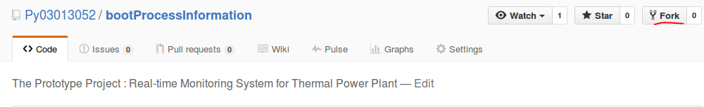


Forked bootProcessInformation in your GitHub account


## Step Two:  Clone fored bootProcessInformation to your local  respority

Start clone: git 

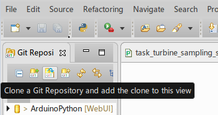

copy url to clipboard
 
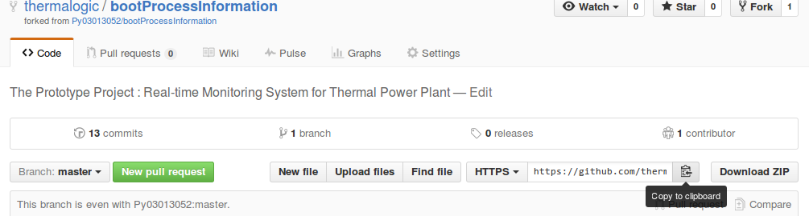

copy source to your local

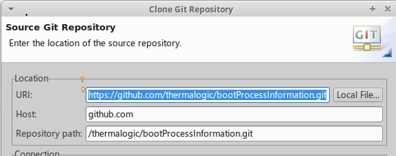

Brance selection

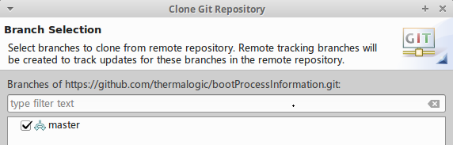

cloned respority 

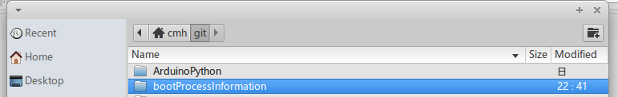

## Step Three: Import to Eclipse Workspace 

import to your workspace

File->import

general->Existing  Projects

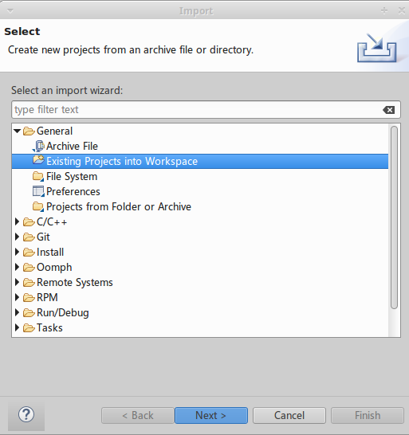

choose your project

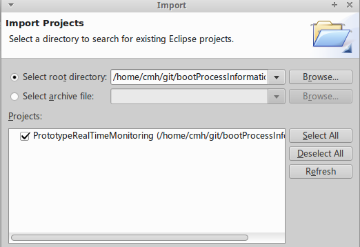

imported projects
 
3_workspace_imported.png

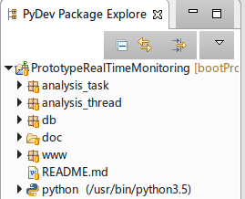

## Step Four: Coding your task 

### 4.1 your analysis_task package 

new pythhon package m300exair

/PrototypeRealTimeMonitoring/analysis_task/m300exair

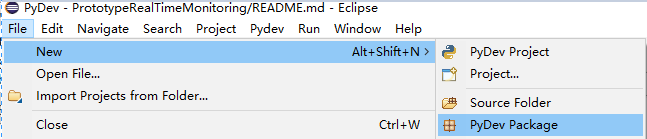


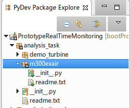

copy all files of  ``analysis_task/demo_turbine``` to your m300exair , rename to


```
analysis_task
     |
     |--m300exair
         |
         |--readme.txt: your task introduction
         |
         |--__init__.py  :  module
         |
         |--pyexair.py : task analysis code
         |
         |--task_exair_tag_in.txt: input tag of your task (utf-8)
         |
         |--task_exair_tag_out.txt: input tag of your task (utf-8)
         |
         |--task_exair_sampling_simulation.py： sampling simulation on task_exair_tag_in.txt to redis
         |
         |--task_exair_online_analysis.py：
 
```

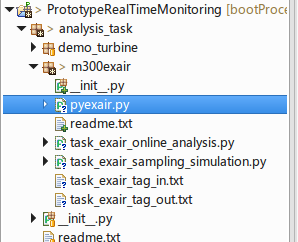


then,coding: 

#### 4.1.1 /analysis_task/__init__.py


```python
# add your module here
from analysis_task.m300exair import *
```

####  4.1.2 pyexair.py

```python
def exaircoff(o2):
    return 21/(21-o2)
```

#### 4.1.3 tag about exair

m300exair/task_exair_tag_in.txt
```
id	desc	defaultvalue
DEMO.DCS2AI.2JZA2226	空预器进口烟气氧量	3.8375
```

m300exair/task_exair_tag_out.txt
```
id	desc defaultvalue
DEMO.DCS2AO.EXAIRCOFF  空预器进口过量空气系数     1.25
```
#### 4.1.4 m300exair/task_exair_online_analysis.py

```python
from datetime import datetime
import codecs

from db.pyredis import TagDefToRedisHashKey, tagvalue_redis, SendToRedisHash
from analysis_task.m300exair.pyexair import exaircoff

class UnitExaircoff:

    def __init__(self, tagin, tagout):
        self.ailist = []
   
        file = codecs.open(tagin, 'r', 'utf-8')
        with file:
            discardline = file.readline()
            for line in  file:
                tagid, desc, value = line.split()
                self.ailist.append({'id':tagid}) 
      
    
        self.aolist = []
        file = codecs.open(tagout, 'r', 'utf-8')
        with file:
            discardline = file.readline()
            for line in  file:
                tagid, desc, value = line.split()
                self.aolist.append({'id':tagid, 'desc':desc, 'value':None, 'ts':None}) 
 
    def setouttag(self):
        TagDefToRedisHashKey(self.aolist)
 
    def Onlinecal(self):
        o2 = float(self.ailist[0]['value']) 
        cur_exaircoff =exaircoff(o2)
        self.aolist[0]['value'] = cur_exaircoff
    
    def run(self):
        tagvalue_redis(self.ailist)
        self.Onlinecal()
        curtime = datetime.now()
        for tag in self.aolist:
            tag['ts'] = curtime 

        SendToRedisHash(self.aolist)

        tagvalue_redis(self.aolist)
        
        for tag in self.aolist:
            print(tag['desc'], tag['value'])

```

#### 4.1.5 /m300exair/task_exair_sampling_simulation.py

```python
class UnitExaircoffSimulation:

    def __init__(self, tagfile):
        
        self.ailist = []
        file = codecs.open(tagfile, 'r', 'utf-8')
        with file:
            discardline = file.readline()
            for line in  file:
                tagid, desc, value = line.split()
                self.ailist.append({'id':tagid, 'desc':desc, 'value':float(value)}) 
      
        self.o2base = self.ailist[0]['value'] 
  
    def settag(self):
        TagDefToRedisHashKey(self.ailist)
 
    def run(self):
        self.ailist[0]['value'] = self.o2base * (1 + random.random() * 0.005)
        
        curtime = datetime.now()
        for tag in self.ailist:
            tag['ts'] = curtime 
        SendToRedisHash(self.ailist)

        print('UnitExaircoffSimulation sampling on ', self.ailist[0]['value'])

```

### 4.2 your analysis_task to analysis_thread

#### 4.2.1 /analysis_thread/sampling_simulation_thread_runner.py

Add code

```python
try:   
    from analysis_task.m300exair.task_exair_sampling_simulation import UnitExaircoffSimulation
except:
    import sys
    sys.path.append("..")
    from  analysis_task.m300exair.task_exair_sampling_simulation import  UnitExaircoffSimulation
 
  # add you tesk
    taginfile = os.path.join(analysis_taskpath, "m300exair", "task_exair_tag_in.txt")
    
    Simulation = UnitExaircoffSimulation(taginfile)
    TaskList.append(Simulation)    
```

Test Running

/m300exair/task_exair_sampling_simulation.py

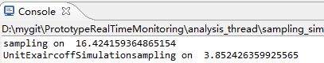


#### 4.2.2 analysis_thread/online_analysis_thread_runner.py

Add code

```python
# add your module 
try:
    from analysis_task.m300exair.task_exair_online_analysis import UnitExaircoff
except:
    import sys
    sys.path.append("..")
    from analysis_task.m300exair.task_exair_online_analysis import UnitExaircoff
    
     # add your task
    taginfile = os.path.join(analysis_taskpath, "m300exair", "task_exair_tag_in.txt")
    tagoutfile = os.path.join(analysis_taskpath, "m300exair", "task_exair_tag_out.txt")
    
    TaskExaircoff = UnitExaircoff(taginfile, tagoutfile)
    TaskList.append(TaskExaircoff)
```

Test Running

analysis_thread/online_analysis_thread_runner.py

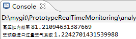


### 4.3 your page and handle to www

#### 4.3.1 page handler
 
 copy  demo files and rename to your task,then codeing
 
 handler/m300exair_tag.txt
 ```
 desc	id	si
空预器进口烟气氧量	DEMO.DCS2AI.2JZA2214   %
空预器进口过量空气系数	DEMO.DCS2AO.EXAIRCOFF	/	
 ```

handler/m300exair_handler.py

```python
cur_tag=gentag("./handler/m300exair_tag.txt")
      
class initHandler(tornado.web.RequestHandler):

    def get(self):

        title = '在线监视客户端： 过量空气系数'
        
        cur_tag.GetTagDefInfo()
        tagvalue = cur_tag.TagSnapshot(


```
modifing `www/__init__.py`

```python
 # add your handler
from www.handler.m300exair_handler import *
 
```

#### 4.3.2 page tamplate

copy demo  tamplate and rename for your tash, 


then modifying ```/templates/m300exair_ui.html``` contents


```javascript
 ws = new WebSocket("ws://" + window.location.host + "/m300exair_websocket");
```
 
 #### 4.3.3 add your page tamplate to site
 
 midifing `/www/app.py`
 ```python
 
 try:
    import www.handler.m300exair_handler as m300exair
except:
    import handler.m300exair_handler as m300exair
    
   handlers = [
           
            (r"/", indexHandler),
    
            
            # add your handler，： 
            (r"/m300exair/", m300exair.initHandler),
            (r"/m300exair_websocket",m300exair.WebSocketHandler),
            
        ]   
    
    
 ```
   midifing `templates/index.html`
  ```javascript 
   <div class="container">
        <h3 class="offset3">分析任务 </h1>
        <ul class="pull-center">
	      <li><a href="/demo_tb/">示例：高压缸效率</a></li>
          <!-- add your link  --> 
          <li><a href="/m300exair/">m300exair:过量空气系数</a></li>
            
    
        </ul>
	   </div>
 ```
 #### 4.3.4 Running
 
 `/www/app.py`
 
 Home Page
 
 
 
 your task page
 
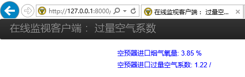 
 
 
## Step Five:  Push to GitHub

### 5.1 commit and push to your fored repository on github

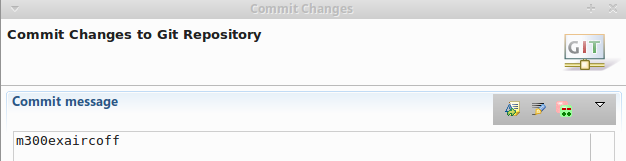 

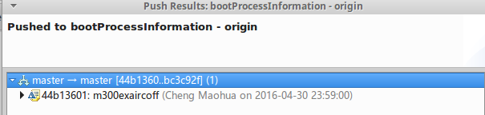 

check result on github

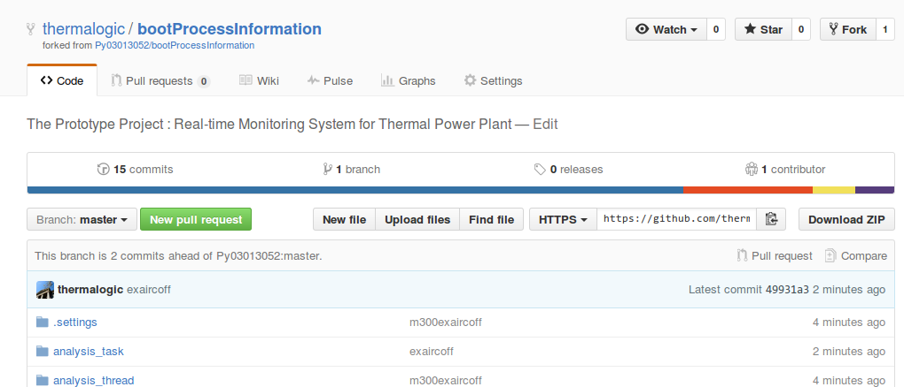


### 5.2 New pull requests to source repository

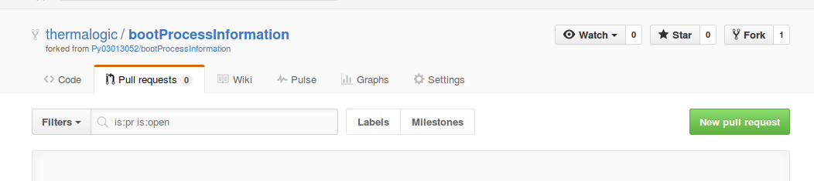

Create  pull request

source repository in the left , your repository in the right

request pull your repository (right) to source repository(left)

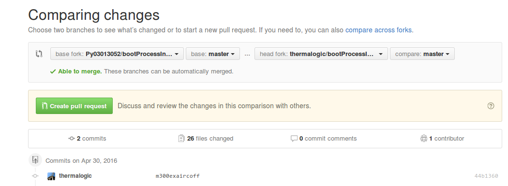

commit message

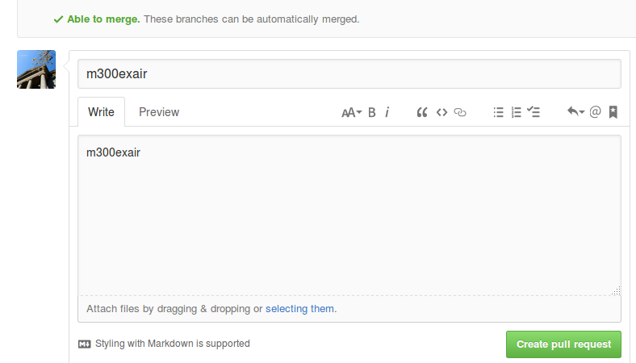

## Step Six:  Merge to the base branch(remote/local)

### 6.1 remote merge

check pull requests:

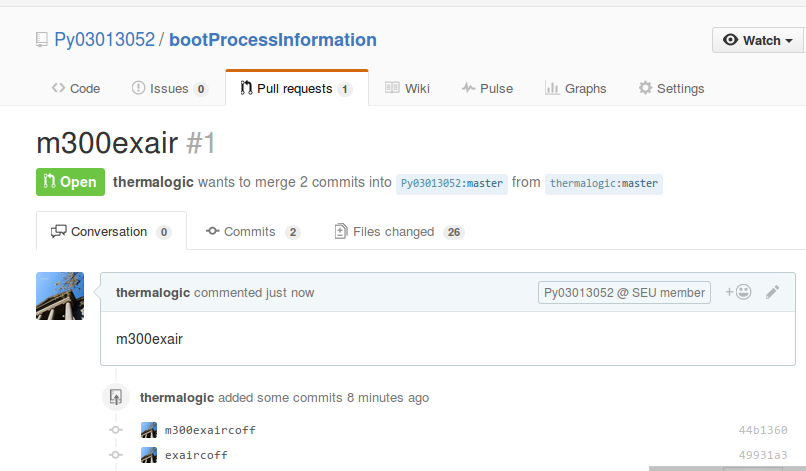

merge pull requests:

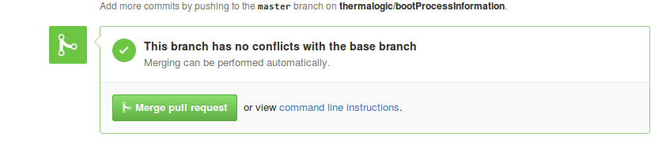

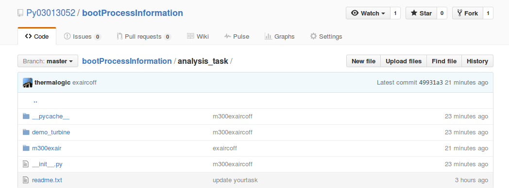

### 6.2 source: pull remote  to  local

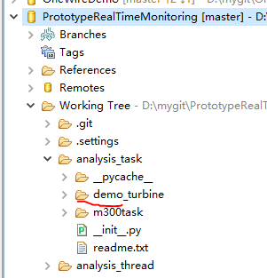


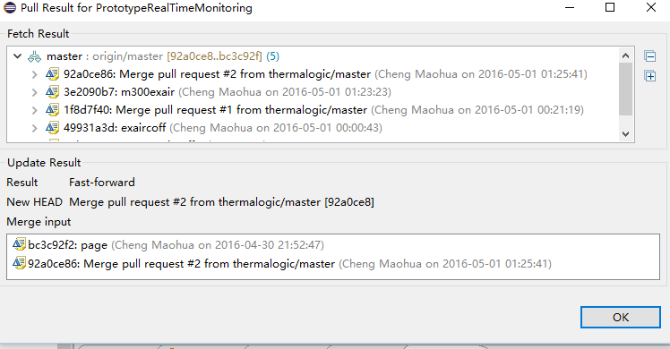

local after pull

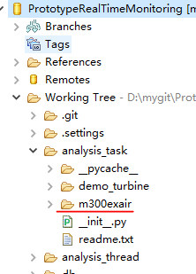

## Step Seven:  forked branch sync with the source branch

the source branch append guide after your forked, 

sync action: 

7.1 new pull request in your forked branch 

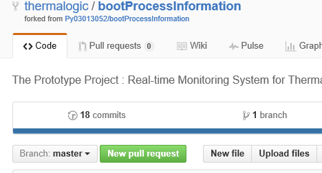

### switching  the  base 

** your forked branch in the left , source repository in the right **

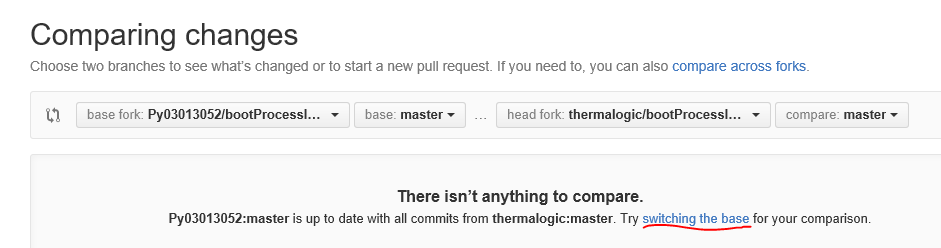

Create　pull request:

note: request pull source branch(right) to your forked branch (left)

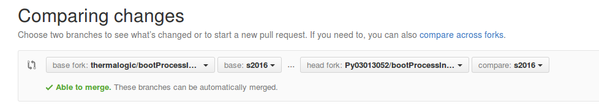

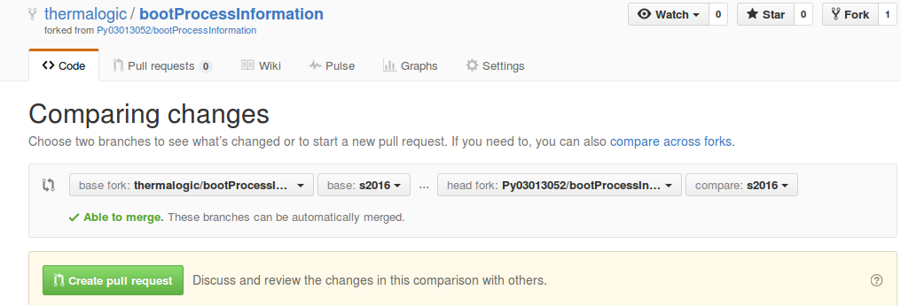

you can see all commit in source branch after you forked

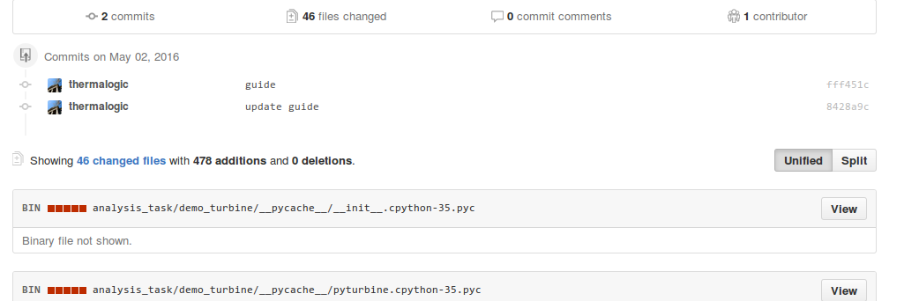

pull request +1 :

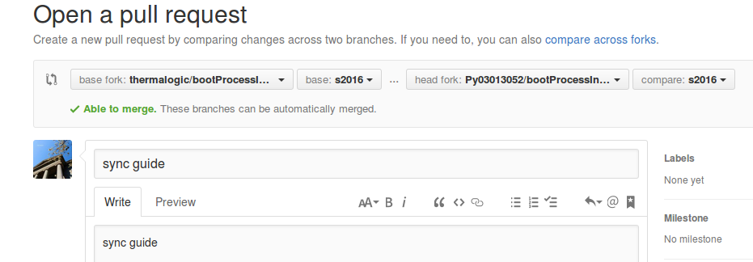


merge pull request(source branch to your branch)


synced branch

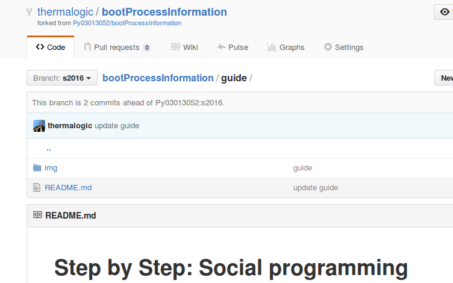